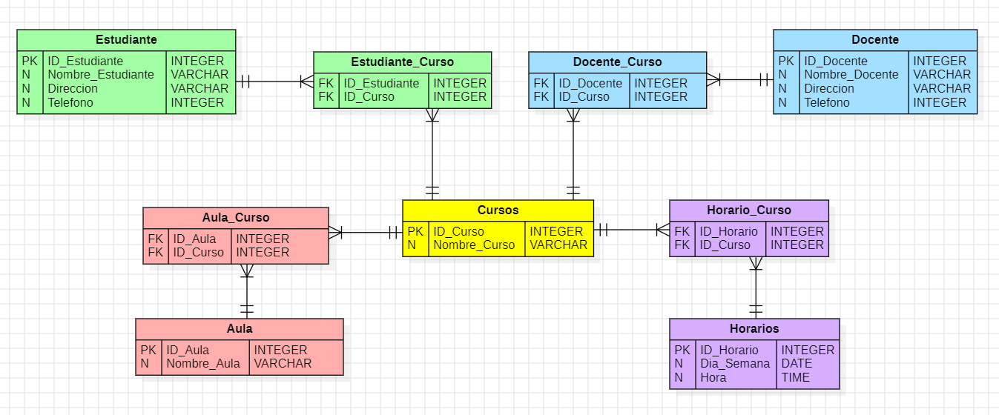

# Ejercicio Universidad

Creacion de Base de datos y tablas para organizar las asignaturas, docentes, horarios y estudiantes del plantel educativo

- [Descripción](#descripción)
- [Primera Forma Normal](#primeraformanormal)
- [Segunda Forma Normal](#segundaformanormal)
- [Tercera Forma Normal](#terceraformanormal)
- [Cuarta Forma Normal](#cuartaformanormal)
- [Diagrama E-R](#diagrama)
- [Lenguajes](#lenguajes)
- [Uso](#uso)
- [Desarrollado](#desarrollado)

# Descripcion
Una universidad está digitalizando su sistema de gestión de asignaturas, docentes y horarios. Actualmente, la información está registrada en una tabla única, pero ha generado redundancias y dificultades para mantener los datos actualizados. Se necesita normalizar la base de datos para que sea más eficiente y evitar la redundancia de datos.

# Primera Forma Normal (1FN)
La Primera Forma Normal establece que una tabla debe cumplir con los siguientes requisitos:

Valores atómicos: No puede haber atributos multivaluados o conjuntos de valores repetidos en una sola celda.
Clave primaria: Cada tabla debe tener una clave primaria que identifique de manera única cada fila.
Acciones tomadas:

Todas las tablas (ESTUDIANTES, CURSOS, DOCENTES, AULA, HORARIOS) tienen una clave primaria claramente definida, lo que garantiza que cada fila sea única.

Las columnas contienen valores atómicos, es decir, no hay grupos de valores o listas dentro de una celda. Por ejemplo, en la tabla ESTUDIANTES, el campo NOMBRE_ESTUDIANTE solo contiene un nombre por estudiante, y DIRECCION solo una dirección.

# Segunda Forma Normal (2FN)
La Segunda Forma Normal se aplica a las tablas que ya están en 1FN y requiere que:

No haya dependencias parciales. En tablas con claves compuestas, todos los atributos no clave deben depender completamente de la clave primaria y no solo de una parte de ella.
Acciones tomadas:
Las tablas que tienen claves compuestas (como ESTUDIANTE_CURSO, DOCENTE_CURSO, AULA_CURSO, HORARIO_CURSO) garantizan que todos los atributos dependan completamente de la clave primaria compuesta. Por ejemplo, en la tabla ESTUDIANTE_CURSO, los campos ID_Estudiante e ID_Curso forman la clave primaria, y no hay otros atributos que dependan solo de una parte de esta clave.

En las tablas con claves simples (como ESTUDIANTES y CURSOS), todos los atributos dependen totalmente de la clave primaria.

# Tercera Forma Normal (3FN)
La Tercera Forma Normal añade una restricción adicional:

No debe haber dependencias transitivas, lo que significa que los atributos no clave no deben depender de otros atributos no clave. Todos los atributos deben depender directamente de la clave primaria.
Acciones tomadas:
En todas las tablas, los atributos no clave dependen únicamente de la clave primaria. Por ejemplo, en la tabla DOCENTES, los campos NOMBRE_DOCENTE, DIRECCION, y TELEFONO dependen solo de ID_DOCENTE.

No se encuentran dependencias transitivas, lo que significa que los atributos no clave no dependen unos de otros. Por ejemplo, en ESTUDIANTES, no hay ningún campo que dependa de DIRECCION o TELEFONO; todos dependen solo de ID_ESTUDIANTE.

# Cuarta Forma Normal (4FN)
La Cuarta Forma Normal se asegura de que no existan dependencias multivaluadas en una tabla. Una dependencia multivaluada ocurre cuando un atributo depende de una parte de la clave primaria, mientras que otro conjunto de atributos depende de otra parte de la clave, generando redundancia.

Acciones tomadas:
Se evitó almacenar varias dependencias multivaluadas en una sola tabla. Por ejemplo, si un docente imparte varios cursos en distintas aulas y horarios, estas relaciones se almacenan de forma independiente en las tablas:
DOCENTE_CURSO para asignar docentes a cursos.

AULA_CURSO para asignar aulas a cursos.

HORARIO_CURSO para asignar horarios a cursos.

De este modo, cada relación multivaluada se ha descompuesto en tablas independientes, eliminando cualquier redundancia y asegurando que se cumple con la 4FN.

# Diagrama E-R

Diagramado de la Base de Datos.. 📋

# Lenguaje

Base de datos en MySQL 

# Uso

> [!important]
> Abrir el repositorio y descargar su contenido
> descomprimir el zip 
> Ingresa al programa MySQL Workbench y abre los scripts que se encuentran dentro de la carpeta del repositorio previamente descomprimida
> listo ya se ecuentra dentro de la DB.

# Desarolladores 

Laura Carrillo - Tecnologa en Desarrollo de Sistemas Informaticos
| @cordilauoficial |  

Felipe Velandia - Camper
| @velandia____ | 
